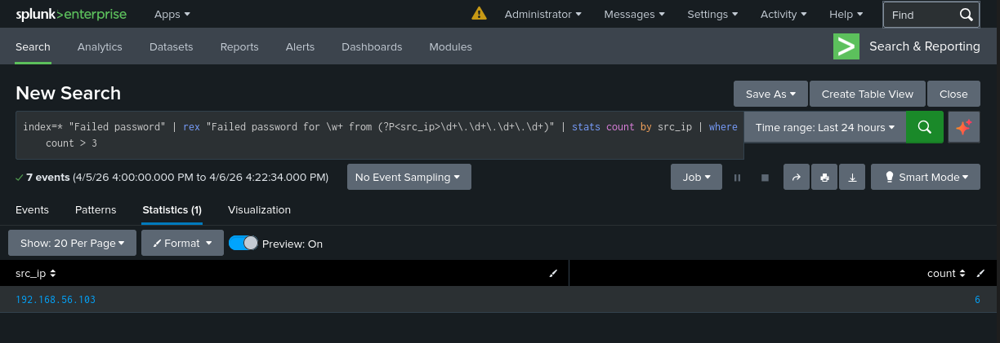
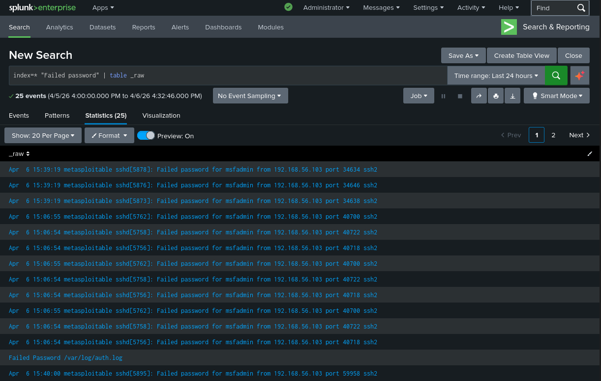
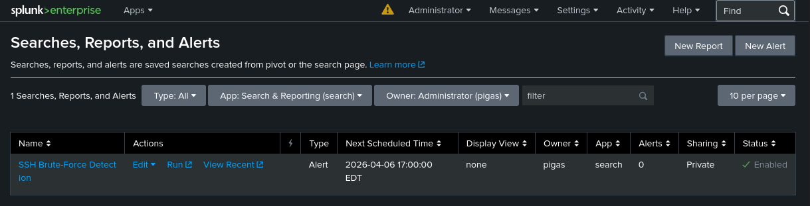

# SSH Brute-Force Detection with Splunk

**Author:** Guilherme Pigoso  
**GitHub:** [github.com/GPigoso](https://github.com/GPigoso)  
**Date:** April 2026  
**Difficulty:** Beginner  
**Category:** Blue Team | SIEM | Threat Detection  

---

## Objective

Simulate an SSH brute-force attack in a controlled home lab environment and detect it using Splunk. The goal is to demonstrate the ability to ingest logs, build detection queries, and configure automated alerts — core skills for a SOC Analyst role.

---

## Environment

| Component | Details |
|---|---|
| **Attacker** | Kali Linux (192.168.56.103) |
| **Target** | Metasploitable2 (192.168.56.102) |
| **SIEM** | Splunk Enterprise (running on Kali) |
| **Network** | VirtualBox Host-Only Adapter |
| **Virtualization** | Oracle VirtualBox |

---

## Tools Used

| Tool | Purpose |
|---|---|
| **Medusa** | SSH brute-force simulation |
| **Netcat (nc)** | Log transfer from Metasploitable2 to Splunk |
| **Splunk Enterprise** | Log ingestion, detection query and alerting |

---

## MITRE ATT&CK Mapping

| Tactic | Technique | ID |
|---|---|---|
| Credential Access | Brute Force: Password Guessing | T1110.001 |

---

## Attack Simulation

### Step 1 — Verify SSH is open on target

```bash
nmap -p 22 192.168.56.102
```

Result: Port 22 (SSH) confirmed open on Metasploitable2.

### Step 2 — Create a small wordlist

```bash
echo -e "password\n123456\nmsfadmin\nadmin\nroot" > /tmp/small_wordlist.txt
```

### Step 3 — Launch brute-force attack with Medusa

```bash
medusa -h 192.168.56.102 -u msfadmin -P /tmp/small_wordlist.txt -M ssh -t 4 -v 4
```

Medusa successfully found valid credentials: `msfadmin:msfadmin`.  
All failed attempts were recorded in `/var/log/auth.log` on the Metasploitable2 machine.

---

## Log Ingestion

### Step 4 — Configure Splunk to listen on TCP port 8888

In Splunk: **Settings → Data Inputs → TCP → New**  
- Port: `8888`  
- Source type: `syslog`  

### Step 5 — Send logs from Metasploitable2 to Splunk

```bash
cat /var/log/auth.log | nc 192.168.56.103 8888
```

Logs were successfully received by Splunk via Netcat.

---

## Detection

### Step 6 — Query to detect brute-force activity

```splunk
index=* "Failed password" 
| rex "Failed password for \w+ from (?P<src_ip>\d+\.\d+\.\d+\.\d+)" 
| stats count by src_ip 
| where count > 3
```

**Query breakdown:**
- `index=*` — search across all indexes
- `"Failed password"` — filter SSH authentication failures
- `rex` — extract the attacker IP using regex
- `stats count by src_ip` — count failed attempts per IP
- `where count > 3` — flag IPs exceeding the threshold (brute-force signature)

**Result:** IP `192.168.56.103` detected with **6 failed login attempts** — confirmed brute-force activity.



---

## Raw Log Evidence

The raw logs confirmed repeated failed SSH authentication attempts from the attacker IP against the `msfadmin` account:

```
Apr 6 15:06:54 metasploitable sshd[5758]: Failed password for msfadmin from 192.168.56.103 port 40722 ssh2
Apr 6 15:06:54 metasploitable sshd[5756]: Failed password for msfadmin from 192.168.56.103 port 40718 ssh2
Apr 6 15:06:55 metasploitable sshd[5762]: Failed password for msfadmin from 192.168.56.103 port 40700 ssh2
```



---

## Alerting

### Step 7 — Create automated alert in Splunk

- **Alert name:** SSH Brute-Force Detection  
- **Type:** Scheduled — runs every hour  
- **Trigger condition:** Number of results > 0  
- **Action:** Add to Triggered Alerts  
- **Status:** Enabled  



---

## Key Takeaways

- SSH brute-force attacks generate a high volume of `Failed password` entries in `/var/log/auth.log`
- Splunk can ingest logs via TCP and detect attack patterns using SPL queries
- A simple threshold-based rule (more than 3 failed attempts from the same IP) is an effective first detection layer
- In a real SOC environment, this alert would trigger an investigation to determine if any attempts were successful and if lateral movement occurred

---

## Next Steps

- Implement **GeoIP lookup** to identify the geographic origin of the attacking IP
- Correlate with **successful logins** to detect if brute-force led to a compromise
- Forward logs automatically using **Splunk Universal Forwarder** instead of Netcat
- Map additional TTPs using **MITRE ATT&CK Navigator**
